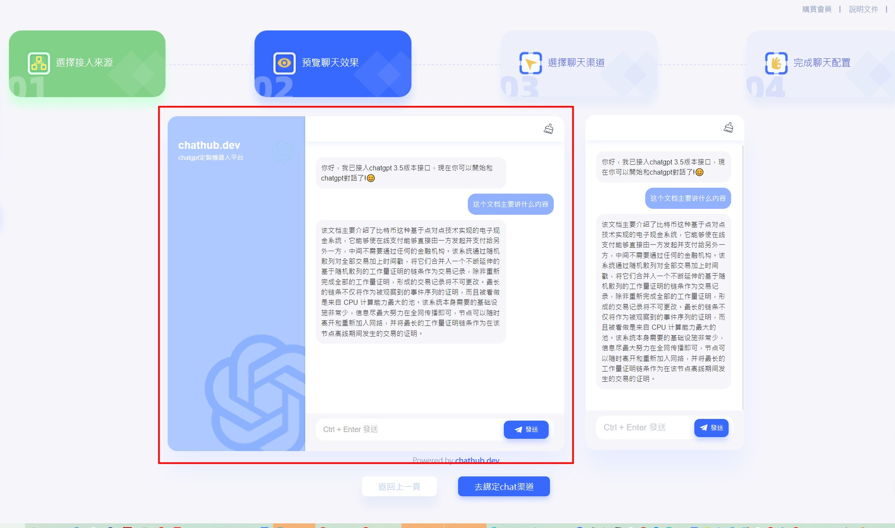

# 📪 如何接入telegram

## Step 1 - 创建telegram机器人

使用 **BotFather** 创建新的 Telegram 机器人 在将机器人连接到 Telegram 之前，使用 BotFather 创建 Telegram 机器人。 启动 与 BotFather 的新对话。 发送 命令/newbot 创建Telegram 机器人,获取机器人的token

<figure><figcaption></figcaption></figure>

## Step 2 - 立即创建机器人&#x20;

我们下面有以训练《比特币白皮书》文档为例，接入telegram bot来实操一次！

<figure><figcaption></figcaption></figure>

## step 3 - 上传文档

文档上传成功后，点击“提交”按钮

<figure><figcaption></figcaption></figure>

## step4 - 测试训练后数据

## 文档上传成功后，系统会对数据进行训练

<figure><figcaption></figcaption></figure>

## step 5 - 选择接入chat渠道

<figure><figcaption></figcaption></figure>

## step6 - 选择 telegram

<figure><figcaption></figcaption></figure>

填写bot的相关信息

<figure><figcaption></figcaption></figure>

**特别注意：**

机器人名称: 这个你可以随意填写；

userName: 这个必须按照你创建的telegram真实username填写，否则不能进行通信！

<figure><figcaption></figcaption></figure>

token: 这个地址就是 **BotFather里面创建bot成功后的token**

<figure><figcaption></figcaption></figure>

## step 7 - telegram创建成功后，体验服务！

.jpg>)             

**PS：联系我们！**

如果你在使用过程中碰到问题，或者有什么建议，欢迎扫码加入！

<figure><figcaption></figcaption></figure>
